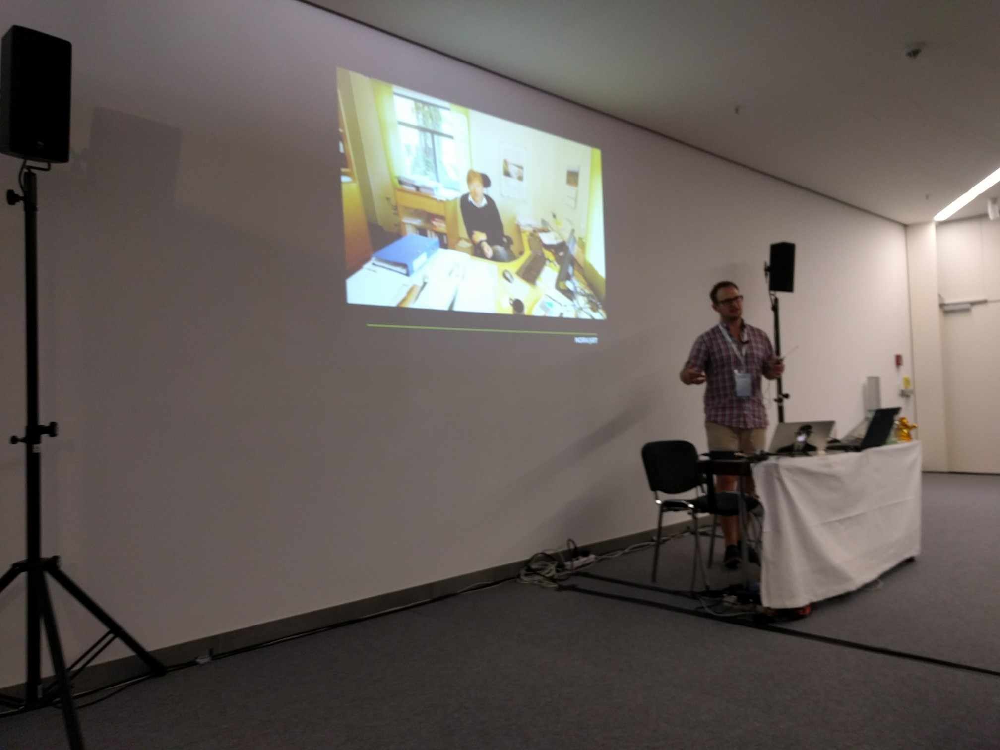

title: Reisebrev fra Bonn
author:
  name: Robert Nordan
  twitter: robpvn
  url: https://github.com/Norkart
theme: Norkart/cleaver-theme
--
#Reisebrev fra Bonn

--

#Europa => Europeere

--

#Misbruk av campingvogn

--

#Ingen dominerende trend 

--

#Copernicus - Sentinels in the sky

--

#Modning av tidligere omtalte prosjekt

--

#Vector Tiles == Mapbox Vector Tiles

--

#Skyen og parallell prosessering

--

#Kommersialisering

--

#Åpne data er de beste data

--

#Nordmenn stilte sterkt

--

#Tysk effektivitet på videoene
[http://video.foss4g.org/foss4g2016/videos](http://video.foss4g.org/foss4g2016/videos)
--

#Neste gang blir i Boston

--

#Geohaiku
